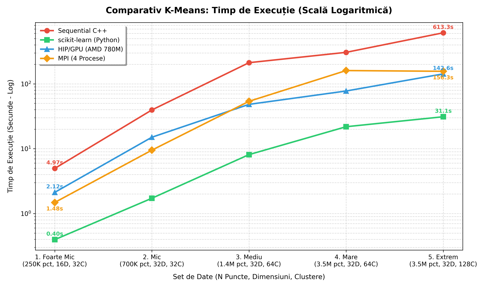
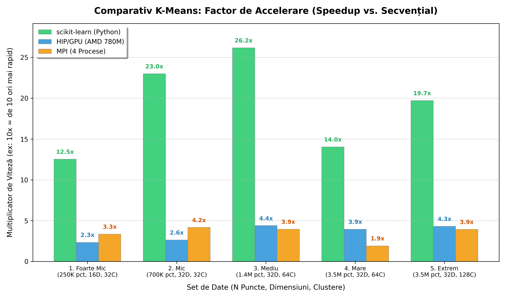
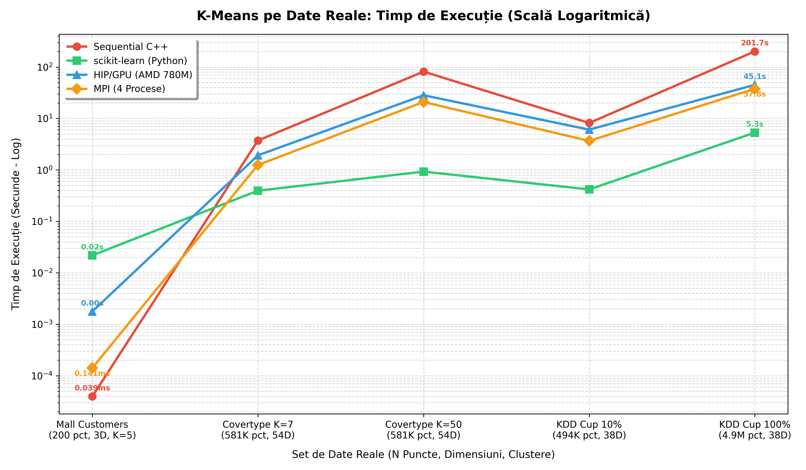
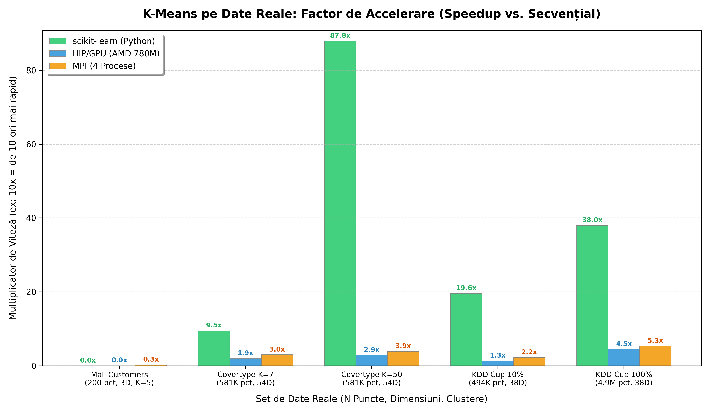

# KMeans-GPU-Benchmark

A high-performance benchmark of the K-Means clustering algorithm across **4 parallel implementations**: a sequential C++ baseline, a scikit-learn vectorized variant, a HIP/GPU kernel for AMD GPUs, and an MPI distributed variant.

## 📌 Project Overview

The goal of this project is to demonstrate the speedup that parallelism achieves over a sequential CPU baseline in highly parallelizable machine learning tasks. K-Means clustering is an **Embarrassingly Parallel** problem — every point's cluster assignment in the Expectation step is completely independent, making it the ideal candidate for GPU and distributed computing.

This repository benchmarks the algorithm across 4 implementations, all running on the **same datasets** and measuring only the core algorithmic loop (I/O excluded).

📊 **PowerPoint Presentation**: A complete summary of the benchmark, results, and architecture can be found in [KMeans_Presentation.pptx](KMeans_Presentation.pptx).

---

## 🗂️ Implementations

| # | Variant | File | Parallelism Strategy |
|---|---------|------|---------------------|
| 1 | **Sequential C++** | `kmeans_seq.cpp` | Single-threaded, CPU baseline |
| 2 | **scikit-learn (Python)** | `kmeans_sklearn.py` | Vectorized BLAS (NumPy/OpenBLAS), multi-threaded |
| 3 | **HIP/GPU (AMD)** | `kmeans_hip.cpp` | GPU kernels via `hipcc`, AMD Radeon 780M (gfx1103) |
| 4 | **MPI (Distributed CPU)** | `kmeans_mpi.cpp` | Domain decomposition + `MPI_Allreduce`, 4 processes |

All implementations share:
- **Same algorithm** — Lloyd's algorithm, Forgy random initialization
- **Same optimization** — Squared Euclidean distance (no `sqrt()`)
- **Same design** — Data-Oriented Design (flat contiguous arrays)
- **Same output format** — iterations, execution time (ms), centroids, point counts

---

## 📊 Benchmark Results

All tests were run on an **AMD Ryzen 7 7840HS** with **AMD Radeon 780M iGPU (gfx1103)**, compiled with `-O3`.

### Execution Times (milliseconds)

| Dataset | $N$ | $D$ | $K$ | Sequential | sklearn | HIP/GPU | MPI (4P) |
|---------|-----|-----|-----|------------|---------|---------|----------|
| **1. Very Small** | 250,000 | 16 | 32 | 4,965 ms | **396 ms** | 2,122 ms | 1,484 ms |
| **2. Small** | 700,000 | 32 | 32 | 39,605 ms | **1,722 ms** | 15,031 ms | 9,502 ms |
| **3. Medium** | 1,400,000 | 32 | 64 | 212,183 ms | **8,109 ms** | 48,300 ms | 53,818 ms |
| **4. Large** | 3,500,000 | 32 | 64 | 306,346 ms | **21,833 ms** | 77,633 ms | 160,434 ms |
| **5. Extreme** | 3,500,000 | 32 | 128 | 613,309 ms | **31,115 ms** | 142,613 ms | 156,254 ms |

### Speedup vs Sequential Baseline

| Dataset | sklearn | HIP/GPU | MPI (4P) |
|---------|---------|---------|----------|
| **1. Very Small** | 12.5× | 2.3× | 3.3× |
| **2. Small** | 23.0× | 2.6× | 4.2× |
| **3. Medium** | 26.2× | 4.4× | 3.9× |
| **4. Large** | 14.0× | 3.9× | 1.9× |
| **5. Extreme** | 19.7× | 4.3× | 3.9× |

### 📈 Benchmark Visualization





> **Key observations:**
> - **sklearn** is the fastest across all tests — vectorized BLAS routines (computing all N×K distances as a single matrix multiplication) bypass the explicit O(N·K·D) inner loop entirely.
> - **HIP/GPU** scales better than MPI as dataset size grows, overtaking MPI at dataset 3+. The GPU's massive parallelism benefits from larger N.
> - **MPI** is competitive on small/medium datasets but its advantage is limited by the `MPI_Allreduce` communication overhead, which grows with K (especially on dataset 5 with K=128).
> - The **iGPU** (Radeon 780M) uses shared system memory, limiting its memory bandwidth compared to a discrete GPU — a dedicated GPU would show much larger HIP speedups.

---

## 📊 Real-world Dataset Benchmark

To transition from synthetic testing to real-world deployment, the suite was tested against academic datasets from **UCI Machine Learning Repository** and **Kaggle**:
1. **Mall Customers** (Kaggle) — 200 rows × 3 dimensions, $K=5$ customer segments.
2. **Forest Covertype** (UCI) — 581,012 rows × 54 dimensions, $K=7$ semantic forest cover types.
3. **Forest Covertype (Stress)** — 581,012 rows × 54 dimensions, $K=50$ clusters (computational stress test).
4. **KDD Cup '99 (10% subset)** (UCI) — 494,021 rows × 38 numerical dimensions, $K=23$ network intrusion classes.
5. **KDD Cup '99 (Full)** (UCI) — **4,898,431 rows** × 38 numerical dimensions, $K=23$ (large-scale performance benchmark).

### ⚡ Hybrid CPU-GPU Optimization
In early testing, the naive GPU implementation of the Centroid Update phase (Maximization Step) using double-precision `atomicAdd` inside `accumulateCentroidsKernel` caused severe serialization and memory contention on the GPU (millions of threads competing for 23 or 50 centroid memory locations). This made the HIP/GPU implementation slower than Sequential CPU on larger runs.

**Optimization**: The implementation was refactored into a **hybrid GPU-CPU pipeline**:
- **Expectation Step (Distance & Assignment)**: Done on the GPU (massively parallel, no write conflicts).
- **Maximization Step (Centroid Update)**: The `assignments` array (19.6 MB for 5M points) is transferred to the host (takes $<1.5$ ms), and centroid recalculation is performed on the CPU.
This hybrid model resolved the memory contention, yielding a **6.4× speedup** over the naive GPU code and outperforming the sequential C++ baseline.

### Execution Times (milliseconds)

| Dataset | $N$ | $D$ | $K$ | Sequential C++ | scikit-learn (Python) | HIP/GPU (AMD 780M) | MPI (4 Procese) |
|---|---|---|---|---|---|---|---|
| **Mall Customers** | 200 | 3 | 5 | 0.04 ms | 21.86 ms | 1.77 ms | **0.14 ms** |
| **Covertype K=7** | 581,012 | 54 | 7 | 3,738.36 ms | **394.77 ms** | 1,922.17 ms | 1,251.34 ms |
| **Covertype K=50** | 581,012 | 54 | 50 | 81,518.00 ms | **927.96 ms** | 28,308.00 ms | 20,905.30 ms |
| **KDD Cup 10%** | 494,021 | 38 | 23 | 8,182.50 ms | **417.77 ms** | 6,071.91 ms | 3,674.98 ms |
| **KDD Cup 100%** | 4,898,431 | 38 | 23 | 201,664.00 ms | **5,307.35 ms** | 45,089.70 ms | 37,818.60 ms |

### Speedup vs Sequential Baseline

| Dataset | scikit-learn | HIP/GPU | MPI (4 Procese) |
|---|---|---|---|
| **Mall Customers** | 0.00× | 0.02× | 0.28× |
| **Covertype K=7** | 9.47× | 1.94× | 2.99× |
| **Covertype K=50** | 87.85× | 2.88× | 3.90× |
| **KDD Cup 10%** | 19.59× | 1.35× | 2.23× |
| **KDD Cup 100%** | 38.00× | 4.47× | 5.33× |

### 📈 Real-world Benchmark Visualization





---

## 🗃️ Dataset Scaling

Datasets are synthetically generated using `datasets.py` (`sklearn.datasets.make_blobs`). They were mathematically designed to stress the sequential implementation to specific time targets:

| Test Level | $N$ (Points) | $D$ (Dims) | $K$ (Clusters) | Max Iter | Sequential Time |
|------------|-------------|-----------|---------------|----------|----------------|
| **1. Very Small** | 250,000 | 16 | 32 | 100 | ~5 sec |
| **2. Small** | 700,000 | 32 | 32 | 100 | ~40 sec |
| **3. Medium** | 1,400,000 | 32 | 64 | 100 | ~3.5 min |
| **4. Large** | 3,500,000 | 32 | 64 | 100 | ~5 min |
| **5. Extreme** | 3,500,000 | 32 | 128 | 100 | ~10 min |

---

## 🛠️ How to Build and Run

### Prerequisites

```bash
# Python + sklearn (for dataset generation and sklearn variant)
pip install numpy scikit-learn

# C++ compilers
sudo apt install g++ mpic++   # Sequential + MPI
sudo apt install hipcc         # HIP/GPU (AMD ROCm)
```

### 1. Generate Datasets

```bash
cd solutions/
python3 datasets.py
# Creates inputs/01_input_5sec.txt through inputs/05_input_10min.txt
```

### 2. Run All Variants

```bash
cd solutions/

# Sequential baseline
bash run_all_sequential.sh

# scikit-learn (activate venv first if using one)
bash run_all_sklearn.sh

# HIP/GPU — compiles with hipcc --offload-arch=gfx1103
bash run_all_hip.sh

# MPI — compiles with mpic++, runs with 4 processes
bash run_all_mpi.sh
```

Each script compiles (where applicable) and runs the implementation against all 5 datasets in order, printing results to stdout. Output is also saved to `results_seq.txt`, `results_sklearn.txt`, `results_hip.txt`, and `results_mpi.txt`.

### 3. Real-world Datasets Preparation and Benchmarking

To run the benchmarks on real-world datasets:
```bash
cd solutions/

# 1. Download Kaggle Mall Customer segmentation dataset
curl -L -o ~/Downloads/customer-segmentation-tutorial-in-python.zip \
  https://www.kaggle.com/api/v1/datasets/download/vjchoudhary7/customer-segmentation-tutorial-in-python

# 2. Extract and prepare all real-world datasets (Mall Customers, Covtype, KDD Cup)
# This downloads them from UCI/sklearn cache, standardizes them, and writes the flat formats
python3 prepare_real_datasets.py

# 3. Run all implementations on the real-world datasets
# Results are cached to skip already-completed runs if re-executed
bash run_all_real.sh

# 4. Generate the visualization graphs (saved as grafic_real_timpi.png and grafic_real_speedup.png)
python3 plot_real_benchmarks.py
```

### 4. Manual Compilation

```bash
# Sequential
g++ -O3 kmeans_seq.cpp -o kmeans_seq
./kmeans_seq < inputs/01_input_5sec.txt

# sklearn
python3 kmeans_sklearn.py < inputs/01_input_5sec.txt

# HIP/GPU (AMD Radeon 780M = gfx1103)
hipcc --offload-arch=gfx1103 -O3 kmeans_hip.cpp -o kmeans_hip
./kmeans_hip < inputs/01_input_5sec.txt

# MPI
mpic++ -O3 kmeans_mpi.cpp -o kmeans_mpi
mpirun --oversubscribe -np 4 ./kmeans_mpi < inputs/01_input_5sec.txt
```

---

## 📁 Project Structure

```
solutions/
├── kmeans_seq.cpp          # Sequential C++ (CPU baseline)
├── kmeans_sklearn.py       # scikit-learn (vectorized BLAS)
├── kmeans_hip.cpp          # HIP/GPU (AMD, hipcc)
├── kmeans_mpi.cpp          # MPI distributed (4 processes)
├── datasets.py             # Synthetic dataset generator
├── prepare_real_datasets.py# Prepares and formats real datasets (UCI/Kaggle)
├── plot_all_benchmarks.py  # Plotter for synthetic datasets
├── plot_real_benchmarks.py # Plotter for real-world datasets
├── run_all_sequential.sh   # Runner for sequential variant
├── run_all_sklearn.sh      # Runner for sklearn variant
├── run_all_hip.sh          # Runner for HIP/GPU variant
├── run_all_mpi.sh          # Runner for MPI variant
├── run_all_real.sh         # Runner for all variants on real-world datasets
├── results_seq.txt         # Benchmark output — sequential (synthetic)
├── results_sklearn.txt     # Benchmark output — sklearn (synthetic)
├── results_hip.txt         # Benchmark output — HIP/GPU (synthetic)
├── results_mpi.txt         # Benchmark output — MPI (synthetic)
├── inputs/                 # Synthetic inputs (gitignored)
│   ├── 01_input_5sec.txt
│   └── ...
├── inputs_real/            # Real-world inputs (gitignored)
│   ├── real_01_mall_customers_200.txt
│   └── ...
└── results_real/           # Benchmark outputs — real-world datasets
    ├── real_01_mall_customers_200_seq.txt
    └── ...
```

---

## ⚙️ Input Format

All implementations read the same custom format from `stdin`:

```
N D K maxIter hasName
x1_1 x1_2 ... x1_D [name1]
x2_1 x2_2 ... x2_D [name2]
...
```

- `N` — number of points
- `D` — number of dimensions (features)
- `K` — number of clusters
- `maxIter` — maximum number of Lloyd's iterations
- `hasName` — `1` if each row has a string label at the end, `0` otherwise